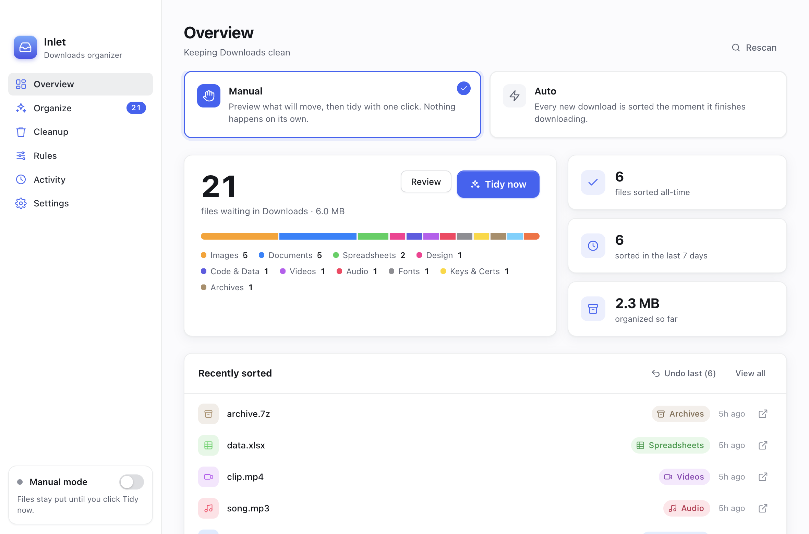
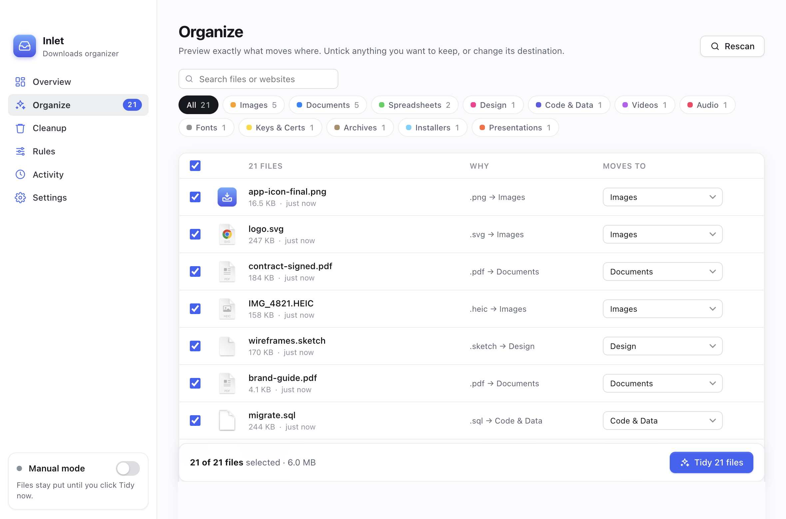
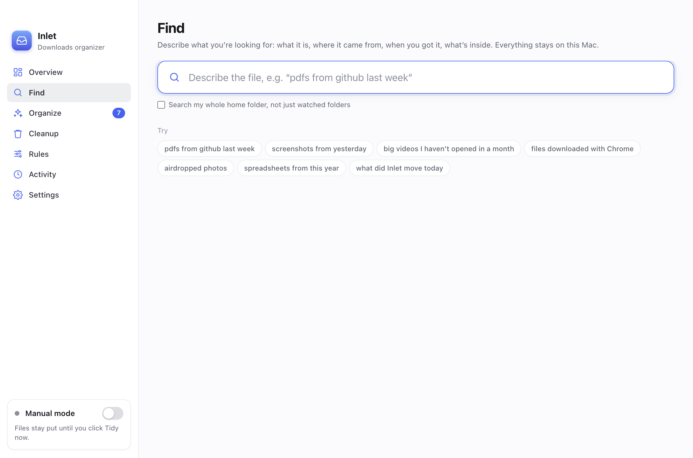
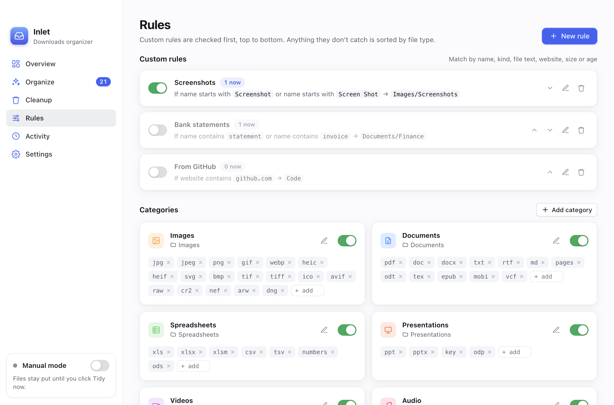
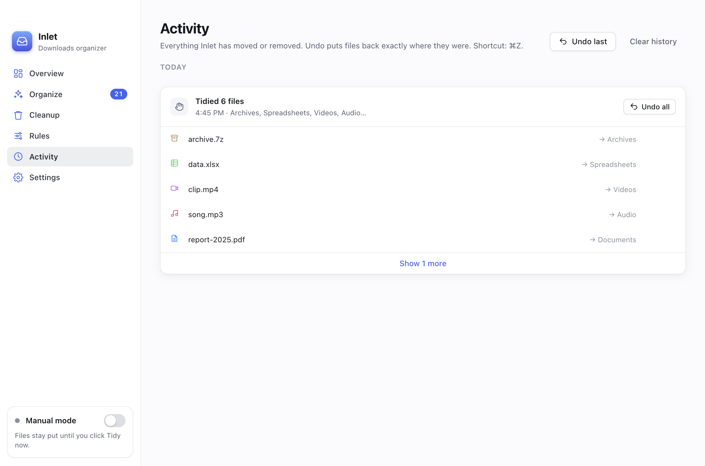

# Inlet

**A free, open-source Mac app that keeps your Downloads folder clean.** Inlet sorts files into tidy folders (Images, Documents, Installers and more) either automatically as they finish downloading, or when you click one button.



- **Nothing is ever deleted or overwritten.** Inlet only moves files, and every move can be undone: from the Activity page, from the menu bar, or with ⌘Z.
- **Your files stay on your Mac.** No account, no cloud, no tracking.

## Download

Get **`Inlet-<version>.pkg`** from [**Releases**](https://github.com/Tech-Reign-Era-Services/inlet/releases/latest). It's one installer for every Mac, Apple silicon and Intel alike. Needs macOS 13 Ventura or later.

### Install

1. Open the `.pkg`. The first time, macOS may stop you (see below).
2. Click **Continue** on the welcome page, then **Continue** and **Agree** on the license.
3. Click **Install**, and enter your Mac password when asked (Inlet goes into your Applications folder).
4. When it's done, click **Close**. Inlet opens by itself and puts its icon in the menu bar.

### "Apple could not verify…" the first time

Inlet is free and not signed with a paid Apple Developer certificate, so macOS asks you to confirm before running the installer. This happens once, for the installer only:

- **Right-click** the `.pkg`, choose **Open**, then click **Open** again, or
- If there's no Open button (newer macOS): try to open it once and close the warning, then go to **System Settings → Privacy & Security**, scroll down, and click **Open Anyway** next to the message about Inlet.

### Update or uninstall

- **Update:** run the new installer. It asks you to quit Inlet first, then replaces it. Your settings and history are kept.
- **Uninstall:** quit Inlet from its menu bar icon and move it from Applications to the Trash. To remove its settings and history too, delete `~/Library/Application Support/Inlet`.

When Inlet first reads your Downloads folder, macOS asks for permission. Click **Allow**.

## What it does



- **Find files by describing them.** Press ⌘F and type what you remember: "pdfs from github last week", "the contract I signed in July", "big videos I haven't opened in a month". Inlet shows what it understood as chips you can remove, says why each file matched, and lets you gather the results into a folder (undoable), preview them, or drag them out.
- **Manual or Auto.** In Manual mode (the default), you see a preview of every file, where it will go and why, before anything moves. In Auto mode, each new download is sorted once it has *finished* downloading. Half-finished `.crdownload`, `.part` and `.download` files are never touched.
- **Scheduled tidy.** A daily sweep at a time you choose.
- **More than Downloads.** Watch Desktop (where screenshots land) or any other folder. Each folder can have its own mode.
- **Rules.** Match files by name, extension, size, age, the website they came from, their Finder kind, or even the **text inside** PDFs and documents. Rules can rename files as they move them, e.g. `scan0001.pdf` → `Documents/Scans/Scan 2026-09-25.pdf`.
- **Remembers where files came from.** Inlet notes the website and app of each download as it arrives, and unzipped files keep their archive's source. macOS itself loses that. Hover over a file to see it. It all stays on your Mac.
- **It learns.** Change where Inlet puts a file (in the app or by dragging it in Finder) and it suggests a rule for next time. Drag a file back into Downloads and Inlet leaves it alone.
- **Cleanup.** Find files you haven't opened in months, and duplicate files. Archive them, or remove them. Removed files wait 30 days in a hidden holding folder so you can undo, then go to the Trash.
- **Your rules on every Mac.** Export and import your rules, or keep them in sync through a folder like iCloud Drive.
- **Folders are left alone.** Project folders and anything that isn't a loose file stay where they are, unless you choose otherwise.







## Build it yourself

You need [Node.js](https://nodejs.org) 20 or later and a Mac.

```bash
git clone https://github.com/Tech-Reign-Era-Services/inlet.git
cd inlet
npm install
npm start          # run Inlet from source
```

To make your own installer:

```bash
npm run dist       # → dist/Inlet-<version>.pkg, one installer for Apple silicon and Intel
```

A build you make yourself opens without the security warning above. To change the installer's pages, edit `build/pkg/` (welcome, license and summary pages; the sidebar image is drawn by `scripts/make-icons.js`).

### Development

```bash
npm test           # engine tests (sorting, undo, watching, cleanup, rules); no Electron needed
```

Try it without touching your real Downloads. A sandbox run uses its own settings, so it runs alongside your real Inlet:

```bash
INLET_WATCH_DIR=/tmp/fake-downloads INLET_DATA_DIR=/tmp/inlet-data npm start
```

`INLET_SCREENSHOTS=/some/dir` captures every page to PNG and quits, which is handy for reviewing UI changes.

Inlet is Electron with a plain HTML/CSS/JS interface (no framework) and no runtime dependencies. The sorting engine in `src/main/` doesn't depend on Electron, so it's tested directly with `node --test`.

| Path | What |
|---|---|
| `src/main/classifier.js` | Decides where one file goes: ignore checks → custom rules → file-type categories → Other |
| `src/main/organizer.js` | Scan (a dry run), move without overwriting (including across disks), undo |
| `src/main/watcher.js` | Auto mode: watches folders, skips in-progress downloads, waits until a file stops changing |
| `src/main/cleanup.js` | Old-file detection, duplicate finder, the holding folder for removed files |
| `src/main/folders.js` | Watched folders: validation, per-folder mode and settings |
| `src/main/spotlight.js` | Finder kind and file text, via macOS Spotlight's own tools |
| `src/main/suggest.js`, `finder.js` | Learning from your corrections, in the app and in Finder |
| `src/main/find/` | Find: `parse.js` turns a sentence into a query, and `search.js` runs it across Spotlight, the download history and Inlet's activity |
| `src/main/portable.js` | Rules file format for export/import and sync |
| `src/main/main.js` | Window, menu bar, notifications, and the bridge to the interface |
| `src/renderer/` | The interface |

Settings and history live in `~/Library/Application Support/Inlet/`. [docs/PLAN.md](docs/PLAN.md) covers the design and roadmap.

## Contributing

Bug reports, ideas and pull requests are all welcome.

- **Questions or ideas:** [Discussions](https://github.com/Tech-Reign-Era-Services/inlet/discussions)
- **Bugs and feature requests:** [Issues](https://github.com/Tech-Reign-Era-Services/inlet/issues/new/choose)
- **Code:** read [CONTRIBUTING.md](CONTRIBUTING.md) first. It covers setup, the safety ground rules, and how pull requests are reviewed. Look for [`good first issue`](https://github.com/Tech-Reign-Era-Services/inlet/labels/good%20first%20issue) to get started.
- **Security problems:** report them privately, as described in [SECURITY.md](SECURITY.md).

Everyone taking part follows the [Code of Conduct](CODE_OF_CONDUCT.md).

## Releasing (maintainers)

1. Bump `version` in `package.json` and add an entry to `src/main/changelog.js` (it's shown in the app's "What's new" window).
2. Commit, then tag and push: `git tag v1.6.0 && git push origin v1.6.0`.
3. The **Release** GitHub Action tests the code, builds the universal installer (`.pkg`), and attaches it to a draft release using the notes in `.github/release-notes.md`. Review the draft on GitHub, then publish it.

## License

[MIT](LICENSE) © 2026 Tech Reign Era Services. Free to use, change and share.

*Inlet was called "Tidy" during early development.*
